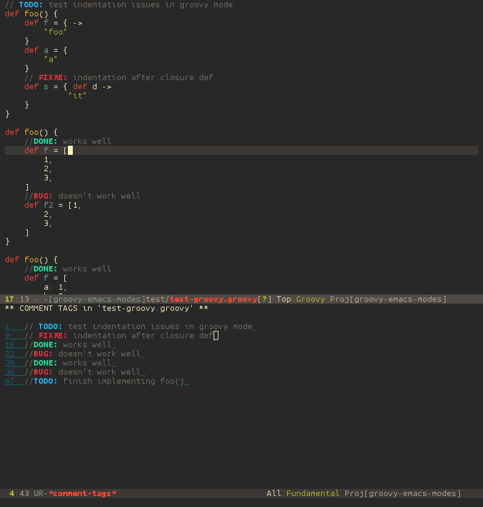
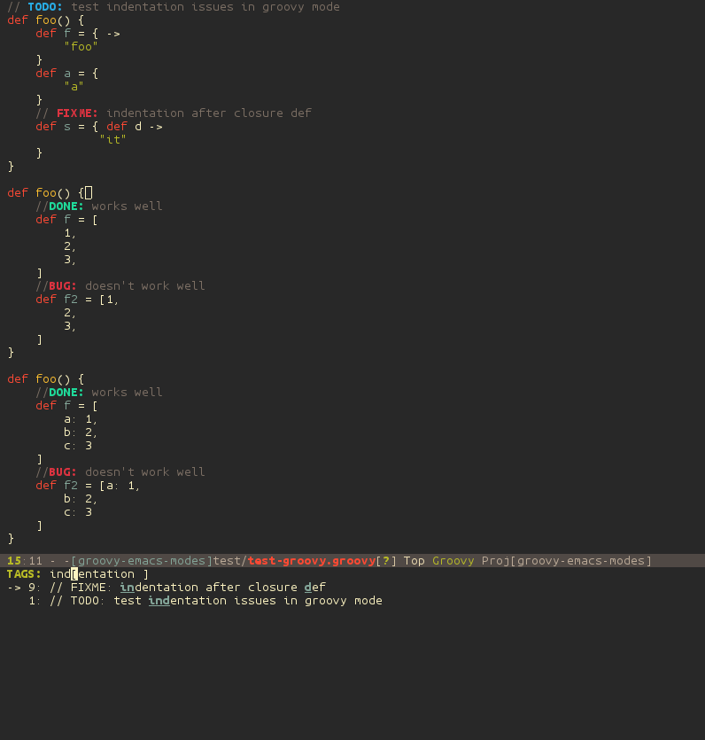

## COMMENT-TAGS.el

An emacs package to highlight and list comment tags such as 'TODO', 'FIXME', 'BUG', 'XXX', 'HACK', 'KLUDGE'.

## Customizations
Ability to customize highlight colors and keywords list.

  * `comment-tags-keywords` to alter the list of highlighted/searched words.
  * `comment-tags-require-colon` to require a matching colon (default t).
  * `comment-tags-comment-start-only` to only match tags at the beginning of a comment (default nil).
  * `comment-tags-keymap-prefix` to alter the default prefix (default `C-c #`).
  * `comment-tags-case-sensitive` to set case-sensitivity (default t).
  * `comment-tags-faces` to set faces for keywords.
  * `comment-tags-lighter` to set modeline text (default nil).
  * `comment-tags-show-faces` to show colors/faces in comment-tags buffer/search (default t).

## Usage
The prefix for commands is `C-c #`.

Commands include:
  * `b` to list tags in current buffer (`comment-tags-list-tags-buffer`).
  * `a` to list tags in all buffers (`comment-tags-list-tags-buffers`).
  * `s` to jump to tag in current buffer by a word or phrase using reading-completion (`comment-tags-find-tags-buffer`).
  * `n` to jump to next tag from point (`comment-tags-next-tag`).
  * `p` to jump to previous tag from point (`comment-tags-previous-tag`).

## TODO:
  * Issues/Features here: https://github.com/vincekd/comment-tags/issues


## EXAMPLE CONFIG
```elisp
(autoload 'comment-tags-mode "comment-tags-mode")
(setq comment-tags-keymap-prefix (kbd "C-c t"))
(with-eval-after-load "comment-tags"
  (setq comment-tags-keyword-faces
        `(("TODO" . ,(list :weight 'bold :foreground "#28ABE3"))
          ("FIXME" . ,(list :weight 'bold :foreground "#DB3340"))
          ("BUG" . ,(list :weight 'bold :foreground "#DB3340"))
          ("HACK" . ,(list :weight 'bold :foreground "#E8B71A"))
          ("KLUDGE" . ,(list :weight 'bold :foreground "#E8B71A"))
          ("XXX" . ,(list :weight 'bold :foreground "#F7EAC8"))
          ("INFO" . ,(list :weight 'bold :foreground "#F7EAC8"))
          ("DONE" . ,(list :weight 'bold :foreground "#1FDA9A"))))
  (setq comment-tags-comment-start-only t
        comment-tags-require-colon t
        comment-tags-case-sensitive t
        comment-tags-show-faces t
        comment-tags-lighter nil))
;; TODO: remove once added to melpa
;;(load-file "~/dev/comment-tags/comment-tags.el")
(add-hook 'prog-mode-hook 'comment-tags-mode)
```


## Screenshots

List tags in buffer and select to jump to point.


Search tags in buffer (with search of line text) and jump to point.

